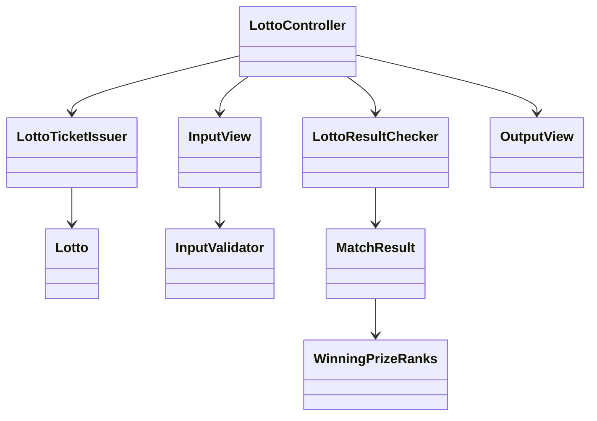
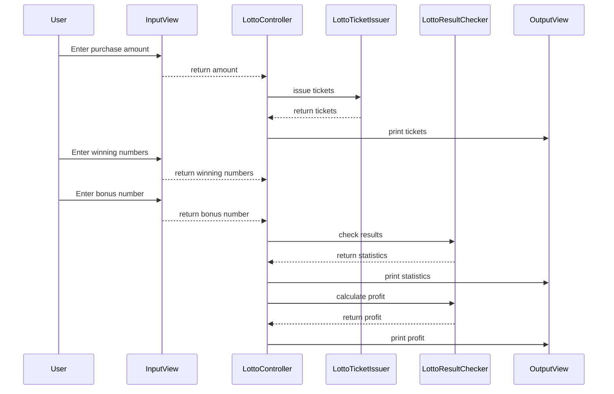

# kotlin-lotto-precourse

## Project Description

A console-based Lotto ticket machine written in Kotlin 1.9.24.  
The user can purchase Lotto tickets, input winning numbers, and check the lottery results and profit rate.  
This project focuses on clean object-oriented design by grouping related functions into classes and writing unit tests for all business logic.  
All inputs are validated, and errors are re-prompted according to functional requirements.  
The solution follows Kotlin coding conventions and the project process guidelines specified for the pre-course.

---

## Feature List

### Input Handling

- At each input step, if the user inputs invalid data,
  the program must throw an `IllegalArgumentException` and re-prompt input from that step.

- Use `Console.readline()` provided by the `camp.nextstep.edu.missionutils` package

1. enter the total price to purchase lottery tickets

- Each ticket costs **1,000 KRW**
- Amount must be divisible by 1,000
- $\text{Number  of  tickets} = \text{Total  Price  Input}/1000$

```
Please enter the purchase amount.
8000
```

2. enter the winning numbers and bounus number

- Input 6 unique winning numbers(comma-separated)
- Input 1 unique bounus number

```
Please enter last week's winning numbers.
1,2,3,4,5,6

Please enter the bonus number.
```

#### Validate the values

##### Purchase Amount must:

- Be non-empty and a numeric value
- Be greater than 0
- Be divisible by 1,000

##### Winning Numbers must:

- Be 6 unique numbers
- Each number must be between 1 and 45 (inclusive)

##### Bonus Number Must:

- Be a numeric value between 1 and 45
- Must not duplicate any of the winning numbers

### Generate Lotto Numbers

- For each ticket, generate 6 unique random numbers
  - Range for lotto number: $1 <= n <= 45$
  - Use `Randoms.pickUniqueNumbersInRange()` provided by the `camp.nextstep.edu.missionutils` package
  - For each ticket, generate 6 unique random numbers sorted in ascending order

### Check Winning Prize Ranks

- Based on the following criteria, determine the prize for each ticket:

| Prize Ranks |            Criteria            | Prize Amount (KRW) |
| :---------: | :----------------------------: | :----------------: |
|     1st     |        Match 6 numbers         |   2,000,000,000    |
|     2nd     | Match 5 numbers + Bonus number |     30,000,000     |
|     3rd     |        Match 5 numbers         |     1,500,000      |
|     4th     |        Match 4 numbers         |       50,000       |
|     5th     |        Match 3 numbers         |       5,000        |

- Matching is based on unique number comparisons(no duplicate matches allowed)
- Tickets that do not match at least 3 numbers are considered "No Prize (NONE)".

### Calculate Profit Rate

- Calculate the `total return rate` using the formula

  $\text{Profit Rate} = \left( \frac{\text{Total Prize Amount}}{\text{Total Purchase Amount}} \right) \times 100$

- `Total Prize Amount` using the formula

  $\text{Total Prize Amount} =$

  $(1\text{st Prize Amount}) \times (1\text{st Win Tickets}) +$

  $(2\text{nd Prize Amount}) \times (2\text{nd Win Tickets}) +$

  $(3\text{rd Prize Amount}) \times (3\text{rd Win Tickets}) +$
  
  $(4\text{th Prize Amount}) \times (4\text{th Win Tickets}) +$

  $(5\text{th Prize Amount}) \times (5\text{th Win Tickets})$

  - The profit rate is rounded to one decimal place.

### Print Output

1. Number of tickets issued and their numbers(sorted in ascending order)

```
You have purchased 8 tickets.
[8, 21, 23, 41, 42, 43]
[3, 5, 11, 16, 32, 38]
[7, 11, 16, 35, 36, 44]
[1, 8, 11, 31, 41, 42]
[13, 14, 16, 38, 42, 45]
[7, 11, 30, 40, 42, 43]
[2, 13, 22, 32, 38, 45]
[1, 3, 5, 14, 22, 45]
```

2. Lotto result statistics

```
3 Matches (5,000 KRW) - 1 tickets
4 Matches (50,000 KRW) - 0 tickets
5 Matches (1,500,000 KRW) - 0 tickets
5 Matches + Bonus Ball (30,000,000 KRW) - 0 tickets
6 Matches (2,000,000,000 KRW) - 0 tickets
```

3. Print profit rate
   Based on `Calculate Profit Rate` Function, print the result of `Calculate Profit Rate`

---

## Class Diagram



---

## Sequence Diagram


---
## Unit Tests

Unit tests are written using **JUnit5** and **AssertJ**.  
All business logic (excluding UI interactions) is covered by unit tests.

### Test Coverage
| Module | Description |
|:------:|:------------|
| LottoTicketIssuerTest | - Issue correct number of tickets based on purchase amount.<br>- Ensure each ticket contains 6 unique numbers between 1–45. |
| LottoTest | - Validate Lotto creation with exactly 6 numbers.<br>- Validate no duplicate numbers.<br>- Validate all numbers within 1–45 range. |
| LottoResultCheckerTest | - Check correct winning rank based on matches and bonus number.<br>- Calculate total prize correctly.<br>- Calculate profit rate based on total prize and purchase amount. |
| InputValidatorTest | - Validate purchase amount parsing:<br> - Empty or non-numeric input<br> - Amount not divisible by 1000<br> - Amount not positive<br>- Validate lotto numbers parsing:<br> - Empty or invalid input<br> - Not exactly 6 numbers<br> - Duplicate numbers<br> - Numbers out of 1–45 range<br>- Validate bonus number:<br>  - Empty or non-numeric input <br> - Duplicate with winning numbers<br> - Out of 1–45 range<br> |
| ApplicationTest | - Simulate complete application flow:<br> - Purchase tickets<br> - Input winning numbers and bonus number<br> - Output winning statistics and profit rate.<br>- Validate error handling on invalid input. |


### Testing Frameworks

- **JUnit 5** for writing unit tests
- **AssertJ** for fluent assertion syntax
- **camp.nextstep.edu.missionutils** for testing random number generation and console input/output


### How to Run Tests

On Windows:

```bash
gradlew.bat clean test
```

On macOS/Linux:

```bash
./gradlew clean test
```

To run a specific test class:

```bash
gradlew.bat clean test --tests "lotto.domain.LottoTicketIssuerTest"
```
